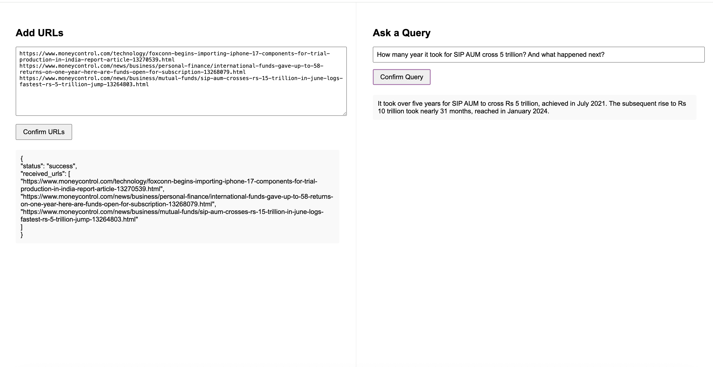

**Install dependencies:**
pip install -r requirements.txt

**To start the Python server, run:**
uvicorn src.server.api:app --reload

**To launch the web application, open:** src/static/index.html

**Demo:**
